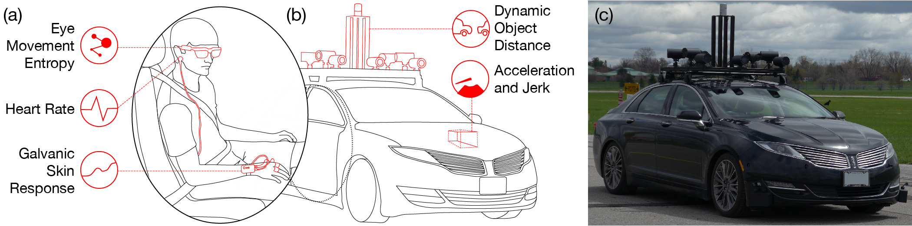
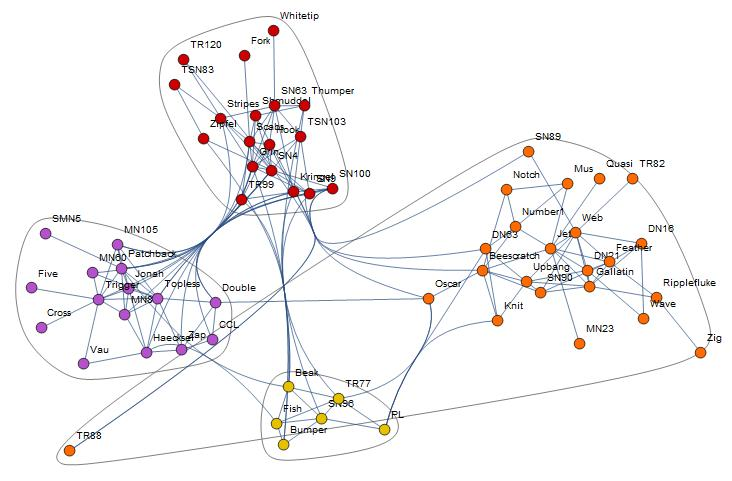

  

I am a full time software engineer who loves working on **NLP research** and other **machine learning** problems. I currently work on the Data Science team at [Boosted.ai](https://boosted.ai), a fintech startup where I work on NLP problems, as well as data engineering and analysis applied to time-series stock market data. I previously worked as an intern at [Google](https://google.com/careers) where I helped develop a large-scale recommendation system for G+ Communities.

I am a former member of the **Autonomoose self-driving vehicle** team at the University of Waterloo's [Waterloo Intelligent Systems Engineering Lab](https://uwaterloo.ca/waterloo-intelligent-systems-engineering-lab/autonomoose), as well as the [Haptic Lab](https://uwaterloo.ca/haptic-computing-lab/), where I completed my Master of Mathematics in Computer Science (Thesis track) in 2019 under the supervision of [Oliver Schneider](http://oliverschneider.ca/) and [Krzysztof Czarnecki](https://uwaterloo.ca/electrical-computer-engineering/profile/k2czarne). My research primarily involved studying *passenger comfort and anxiety* by means of *physiological response* to autonomous driving styles. (Read ***cool news reports*** about the research study [here](https://www.theglobeandmail.com/drive/technology/article-canada-leads-the-way-to-an-autonomous-future/) and [here](https://www.cbc.ca/news/canada/kitchener-waterloo/self-driving-passenger-stress-university-waterloo-1.5241584), and the published paper [here](https://dl.acm.org/doi/abs/10.1145/3313831.3376247)!)

When I'm not working on exciting problems with words and numbers, you can usually catch me learning about my newfound astrophotography hobby, dreaming about dogs, or dabbling in old drawing habits: check out my **art** page on [Instagram](https://www.instagram.com/dillenic/) (:shamefulpromotion)!

## Research Projects
### [Sensing Passenger Comfort and Anxiety in Autonomous Vehicles](https://dl.acm.org/doi/abs/10.1145/3313831.3376247) (ACM CHI 2020)

Autonomous vehicles have been rapidly progressing towards full autonomy using fixed driving styles, which may differ from individual passenger preferences. Violating these preferences may lead to passenger discomfort or anxiety. We studied passenger responses to different driving style parameters in a physical autonomous vehicle. We collected galvanic skin response, heart rate, and eye-movement patterns from 20 participants, along with self-reported comfort and anxiety scores. Our results show that the presence and proximity of a lead vehicle not only raised the level of all measured physiological responses, but also exaggerated the existing effect of the longitudinal acceleration and jerk parameters. Skin response was also found to be a significant predictor of passenger comfort and anxiety. By using multiple independent events to isolate different driving style parameters, we demonstrate a method to control and analyze such parameters in future studies.

### [Position paper on Passenger-vehicle interaction in Fully Autonomous Vehicles](https://ubisys.org/chi19ws-automation/wp-content/uploads/sites/2/2019/05/4-dillen-passenger.pdf) (ACM CHI Workshop 2019)

While current research in human-vehicle interaction tends to focus mainly on the safety driver in Level 3 autonomy, the advent of Level 4 (and even 5) fully autonomous vehicles will shift this focus from
driver to passenger. During the transition phase from partial to full autonomy, passengers are likely to be apprehensive about their safety in a self-driving car. Provisions must therefore be made to minimize passenger anxiety at all times. This work explores current trends in human-vehicle interaction with a directed focus on the passenger, while posing questions that serve to tackle the problem of passenger comfort in fully autonomous vehicles.

### [Modularity-based Community Detection in Fuzzy Granular Social Networks](https://link.springer.com/chapter/10.1007%2F978-981-10-0767-5_60) (2016)

Social network analysis is an important task in the modern, globalised world and has several applications in crime, economy, and human psychology. An important aspect of social network analysis is community detection in which groups of closely connected individuals are identified separately from other groups. In this paper, we proposed a new method for detecting communities in a social network. Our method is inspired by fuzzy granular social networks (FGSN) and uses a popular heuristic modularity-based community clustering algorithm. The results obtained from our algorithm correlate well with those obtained by other popular modularity-based detection methods, making it a promising algorithm for community detection in non-overlapping networks.

